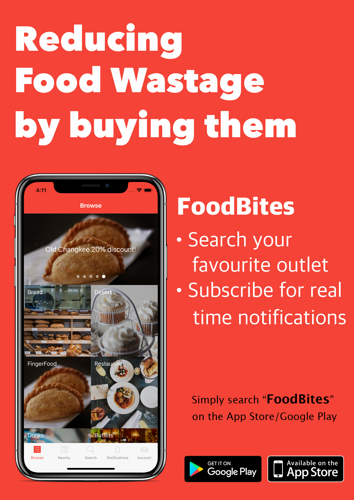

# FoodBites
Group Name : Foodies🍩  
Group Member : KOH CHI HAO , TAN JIN YING  
Proposed Project Level: **Gemini**

FoodBites are here to reduce food wastage in Singapore. In 2016, Singapore had generated a total of 791,000 tonnes of food waste. Out of that, only 14% of it gets recycled. This means that 86% of the remaining gets burnt/dumped into landfills. 

## Our approach to solving the problem
FoodBites aim to reduce food wastage by connecting food stall owners like bakeries, restaurants or even old chang kee to consumers through an mobile application. Through the applications, shop owners are able to post and notify the consumers that are subscribed to their stall that there are going to close for the evening and there are still food available at a discounted price. 

This is a win-win situation for both the consumers and the shop owners. For the shop owners, they are able to generate more profits by selling away all their food items. For consumers, they are able to purchase their favourite food items at a discounted rate! 

## What are our inspirations? 
We have seen mobiles apps from other countries like [OLIO](https://olioex.com/), [Food for all](https://foodforall.com/), [treatsure](https://www.treatsure.co/), and [Food rescue US](https://foodrescue.us/).

## What features are there? 
**Business App**
1) Basic CRUD - shop owners to post food 
2) Automatic Post expiration - shop owners post will eventually get automatically removed after certain hours.
3) Email Login for shop owner
4) Automatic push notification to customers

**Consumer App**
1) Push notifications - consumers notification when the food is on discount
2) Showing nearby food outlets - consumers can search and find based on proximity 
3) Google Login for consumers 
4) Ability to follow different shop outlets

## Tech Stack 
- Backend : 
  - Realtime Database - [Firebase](https://firebase.google.com/docs/database/) 
  - Serverless - [Firebase Cloud Functions](https://firebase.google.com/docs/functions/)
  - Push Notification - [Expo Push Notifications](https://docs.expo.io/versions/latest/guides/push-notifications)
- Frontend 
  - [Expo](https://expo.io/) (React Native)

 

## System Flow 

## Design of the apps 
### User App
    

### Business App
 

# Project Timeline 

### **Milestone 1** 

**Deliverables**:

1. README - This documentation is the readme
2. Project Log: [Access it here](https://docs.google.com/spreadsheets/d/1K4nYnpmKNXQdxT5M6RLzehTtedsVHvJemrZlNi6F2-k/edit?usp=sharing)
3. Video: [Access it here](https://youtu.be/v-gE6hu1ls4)

At the end of Milestone 1, we aim to be ready with the skillset and the needs of our users for out application. As there is a tight timeline to follow, the tools to build our application would be essential. As such, we have chosen to go with React Native for building out application as it allows one code base to be used in both the Android and the iOS environment. Additionally, we have chosen Firebase to be our backend database.

We started by experimenting with pure React Native development. However, we soon realised that using just React Native had some limitations because one of us do not own a MacBook for the iOS development portion. That is when we plan to look into Expo, where you can test and develop iOS and Android apps in React Native without having the need of a Macbook. If all works out well, we will switch over entirely to using Expo for our development and testing process. As for our database, Firebase proves to be a good choice to experiment with as the documentations provided by Google was clear and precise as well as easy to follow. 

For the features to be implemented, we have given priorities to each feature so that more important features would be implemented first to give us our minimum viable product. By the end of Milestone 2, we aim to finish up with those features with the priority ranking of 1 and during Milestone 3, we look to implement the other features. 

We have planned out our user stories using the Agile framework. (See User Stories section below)

For the development plan, both of us will be coming with the design for our application for both the business and users application and setting up of the administrative matters. After that, Chi Hao will be in charge of building the development of the users application and Jin Ying will be in charge of building of the business application.

### **Milestone 2** 

**Deliverables**:

1. README - This documentation is the readme
2. Project Log: [Access it here](https://docs.google.com/spreadsheets/d/1K4nYnpmKNXQdxT5M6RLzehTtedsVHvJemrZlNi6F2-k/edit?usp=sharing)
3. Video: [Access it here]

By Milestone 2, we have came up the Minimum Viable Product for both the FoodBites (User Application) and FoodBites Business (Business Application). 

On FoodBites, we have completed displaying of different categories of food in the app as well as displaying of different post based on their category. Furthermore, we have built in Google login for our consumers to enable ease of login. As such, they do not need to create an email and password account with us. Also, we have enabled shop owners to push notifications to consumers that have subscribed to their outlets. This can ensure the outreach of users for different outlets. Additionally, we have incorporated the ability for consumers to subscribe to different outlets. 
 
On FoodBites Business, we have produce a basic CRUD (Create, Read Update & Delete) for owners to post their food items. We have also implemented a feature to allow the post to expire on its own without the intervention of the user to take down their post. Furthermore, when the post is created by the business owner, the users that is subscribed to the business owner will receive notifications that a new food item is being listed. 

For milestone 3, we look to implement searching for posts and also a panel for the user to see their past notifications on FoodBites. For FoodBites Business, we aim to implement post scheduling and minor improvement on existing features on both the application. 

## User App
> Browse Screen

   

Browse Screen for users to select different food categories.

> Post Category Screen

 

Different posts from the category.

> Post Screen 

 

Post screen with details of the food item such as food expiry time, when the post was created, and the discounted price of the food item.

> Outlet Screen

 >

User is able to subscribe to the outlet and receive notification when the outlet upload a new post. User is also able to see the review for the outlet(happy, sad, neutral).

## Business App
> Biz Home Screen

 

Business home page; outlets are able to see the core information for each post that they posted such as post status, title, original price, discounted price.

> Post Details Screen 

 

Outlets will be able to see the full detailed information of their post. Outlets are also able to repost exisiting post. 

> Post Creation Screen

 >

Outlets are able to upload up to 4 images of their food. They are also able to input their details of the food. 

# User Stories 

For user stories, we have decided to follow the Agile framework. Please click the link to view the entire user stories.

[LINK](https://docs.google.com/spreadsheets/d/1n6myg_zPBbZoBca4gTNpsFASr4yi8E_W2z3kDfVZANo/edit?usp=sharing)
